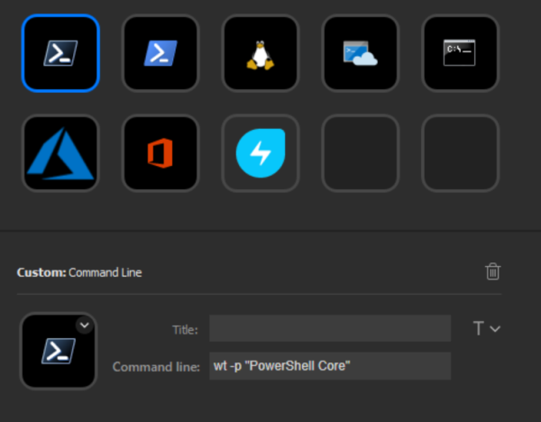

# Stream Deck Command Line

Execute an arbitrary Windows command line from the Elgato Stream Deck.

## Dependencies

Thanks to [Barraider](https://barraider.com) for making these tools available!

* [StreamDeck-Tools](https://www.nuget.org/packages/streamdeck-tools) - Simplifies communication with the Stream Deck app
* [Easy-PI](https://github.com/BarRaider/streamdeck-easypi) - Provides integration with the Stream Deck property inspector
